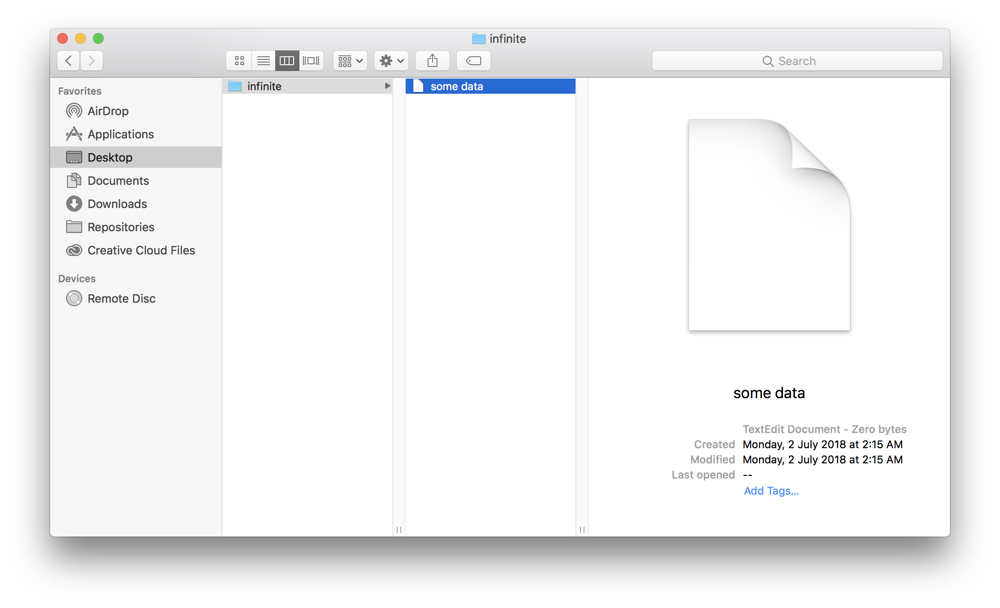

# Infinite

The database that can store the Internet.

Wouldn't it be awesome if you could save the entire Internet into a database?
Well, you can now do so! Infinite exploits a simple loophole in your operating
system to enable you to store an infinite amount of data, without using a
single byte.

## How it works

A file contains data, which is measured in bytes. If a file contains `Hello!`,
it takes up 7 bytes (remember to count the newline character). If a file
contains `Bye bye~`, it takes up 9 bytes. *Simple*.

Now what if a file contains nothing? How many bytes would the file take up?
That's right, 0! But a file can still store data, even if it contains nothing.
Where? In its *name* of course! If we store data in its name, we can now have a
file that stores data, but contains nothing, and thus takes up 0 bytes!

Here, have some evidence.

## Complex documentation

Okay, jokes aside, this project exists simply because I haven't wrote Go in a
while. The idea of an infinite database was just a joke I made while half asleep
in class.
